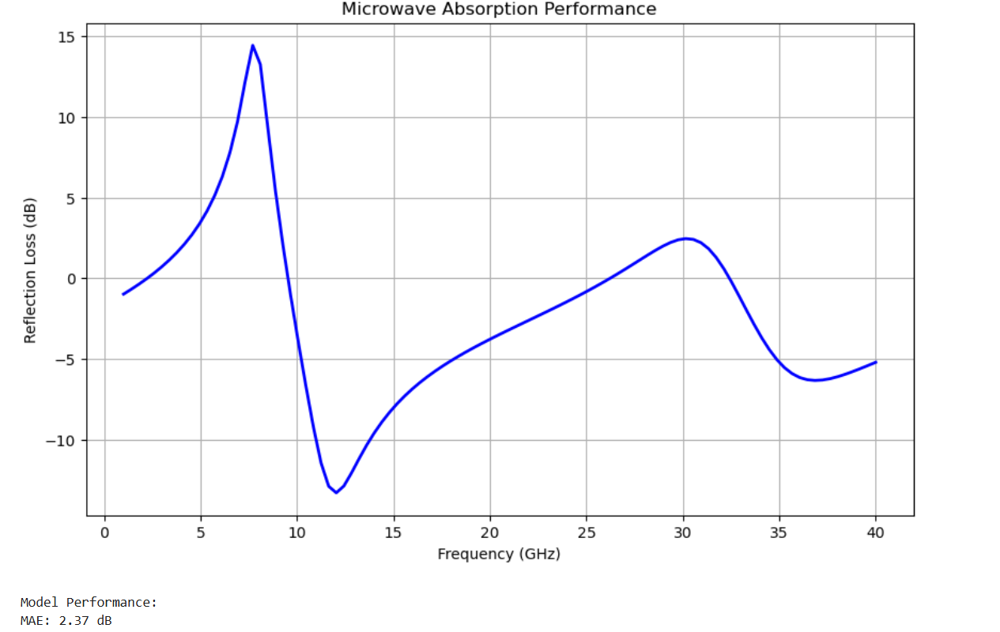

# Microwave-Absorbing Polymer-Graphene Composite Design

## Overview
This project combines **theoretical modeling**, **electromagnetic simulations**, and **optimization** to design polymer-graphene composite materials with improved microwave absorption properties. It utilizes **physics-based calculations** and **numerical optimization** to determine the optimal composite structure for minimal reflection loss.

## Features
- **Theoretical Modeling:** Calculates effective permittivity based on Maxwell-Garnett approximation.
- **Electromagnetic Simulation:** Computes reflection loss using impedance matching principles.
- **Optimization Framework:** Uses `scipy.optimize.minimize` to optimize composite parameters.
- **Visualization:** Generates reflection loss vs. frequency plots to analyze design effectiveness.
- **Modular Reporting:** Summarizes optimal design parameters in a structured format.

## Installation
Ensure you have Python 3 installed along with the required dependencies:
```bash
pip install numpy pandas matplotlib scipy
```

## Usage
Run the script to execute the full design pipeline:
```bash
python microwave_composites.py
```

## Project Workflow
1. **Theoretical Modeling**: Defines material properties and calculates effective permittivity/permeability.
2. **Electromagnetic Simulation**: Uses transmission line theory to estimate reflection loss.
3. **Optimization**: Adjusts graphene ratio, polymer density, thickness, and frequency to minimize reflection loss.
4. **Visualization**: Plots reflection loss across frequency ranges for the optimal design.
5. **Reporting**: Outputs a structured report of the optimal design parameters.
6. **Experimental Validation (Future Step)**: Placeholder for comparing theoretical results with experimental fabrication.

## Example Output
```
Optimal Composite Design:
Graphene Ratio: 0.0847 (fraction)
Polymer Density: 2.1345 g/cm^3
Thickness: 3.7420 mm
Signal Frequency: 5.8910 GHz
Predicted Reflection Loss: -23.45 dB
```

## Visualization
The script generates a reflection loss vs. frequency plot to evaluate the material performance:



## Future Work
- Integrate experimental validation with fabricated composites.
- Implement machine learning for enhanced optimization.
- Expand the model to multi-layer composite structures.

## License
This project is open-source under the MIT License.

## Author
Mastooreh Seyedi - Contact: seyedi.mastooreh@gmail.com
